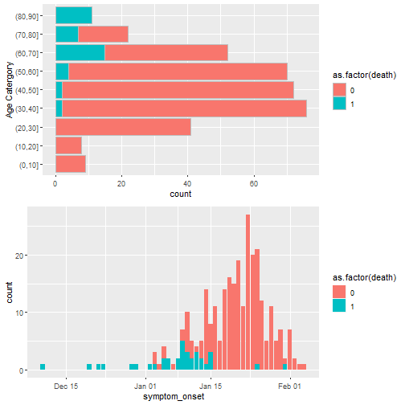
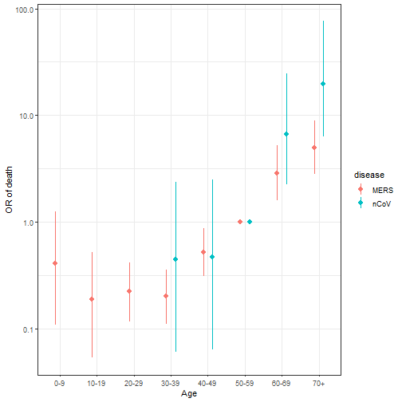

# What is this?

The nCoV Sandbox is a running analytic blog we are "writing" as we try to apply some methods we had in the very early stages of development, and some old friends, to the 2019 nCoV outbreak. It also is us trying to run some analyses to get our on handle on, and keep up to date on, the epidmeiology of the emerging epidemic.

This is a bit of an excercise in radical transparency, and things are going start out very messy...but will hopefully get cleaner and more meaningful as things go. But the old stuff will (for the moment) remain at the botto for posterity.

# Analytic Blog

## Basic Epi Summary 1-24-2020

Simple snapshot as of 2020-24-1 based on snapshot of linelist data
derived from public sources from:
https://docs.google.com/spreadsheets/d/1jS24DjSPVWa4iuxuD4OAXrE3QeI8c9BC1hSlqr-NMiU/edit#gid=1449891965

(AKA the Kudos list).

This is some very basic episnapshots that should be improved 
in the coming days. 


First just take a rough look at the age distribution of cases.
Ten year increments.

```r
  source("R/DataLoadUtils.r")

  kudos <- readKudos2("data/Kudos Line List-1-24-2020.csv") %>%
   mutate(age_cat = cut(age, seq(0,100,10)))
  
  #Age distribution of cases.
  require(ggplot2)
  ggplot(drop_na(kudos, age_cat), 
         aes(x=age_cat, fill=as.factor(death))) + 
    geom_bar( color="grey") + coord_flip() + xlab("Age Catergory")
```



Next, are we seeing any obvious differences in mortality
by gender or age?


```
## Waiting for profiling to be done...
```


|gender | alive| dead|   OR|CI        |
|:------|-----:|----:|----:|:---------|
|male   |    54|   15| 1.00|-         |
|female |    23|    8| 1.25|0.48,3.31 |

```
## Waiting for profiling to be done...
```


|age_cat | alive| dead|     OR|CI                      |
|:-------|-----:|----:|------:|:-----------------------|
|(10,20] |     2|    0|   0.00|0,2.393735337629e+91    |
|(20,30] |     8|    0|   0.00|NA,8.12332729629327e+59 |
|(30,40] |    20|    1|   0.70|0.03,18.71              |
|(40,50] |    21|    1|   0.67|0.02,17.8               |
|(50,60] |    14|    1|   1.00|-                       |
|(60,70] |     8|    9|  15.75|2.34,319.1              |
|(70,80] |     1|    3|  42.00|2.83,1775.73            |
|(80,90] |     1|    8| 112.00|9.58,4388.42            |

Even as sparse as this data is, this is showing some clear
evidence of and age relationship. 


Epidemic curve of line list cases. Not
super informative at this point. 


```r
  ggplot(kudos, aes(x=symptom_onset, fill=as.factor(death))) +
  geom_bar()
```

```
## Warning: Removed 11 rows containing non-finite values (stat_count).
```


A touch interesting that all deaths are early on. This suggests either (A) surveillance was really biased towards deaths in the early days, or (B) a lot of the later reports have not had time to die. 

[Note that there was perviously a 1-23-2020 summary 
but that was too preliminary even for this]

# Planning Notes/Ideas

- Apply basic framework to data so far, focusing on final size first
- Also do some basic epi summaries
    - here is a place for cool visulizations.
- Focus on province/state level in China (including Hong Kong/Macau SAR)
- Run this as a very open excercise in open science.
- Take snapshots of data...starting with stuff from : https://docs.google.com/spreadsheets/d/1jS24DjSPVWa4iuxuD4OAXrE3QeI8c9BC1hSlqr-NMiU/edit#gid=1449891965.
- Get total case snapshot from https://docs.google.com/spreadsheets/d/169AP3oaJZSMTquxtrkgFYMSp4gTApLTTWqo25qCpjL0/edit#gid=975486030
- Basically take snapshots and then post.
- Longer term...use approach and inference stuff for effect of actions.
- Keep a database of dates of intervention actions, major events.
    - 1/22/2020 : Wuhan Quarintine


### Some Tasks
- Download first snapshot, do some basic data cleaning and epi summaries.
- Do some data cleaning and loading
- Make some basic summaries
- Get province level covariates
    - population
    - population density
      - average/high/low
    - Average Feb temperature
    - Average/high-low Absolute humidity
    - Basic demographics (if available)
    - [OTHER WEATHER]
    - [OTHER INDEXES OF URBANIZATOIN/ECONOMY]

- Get the most basic model work
